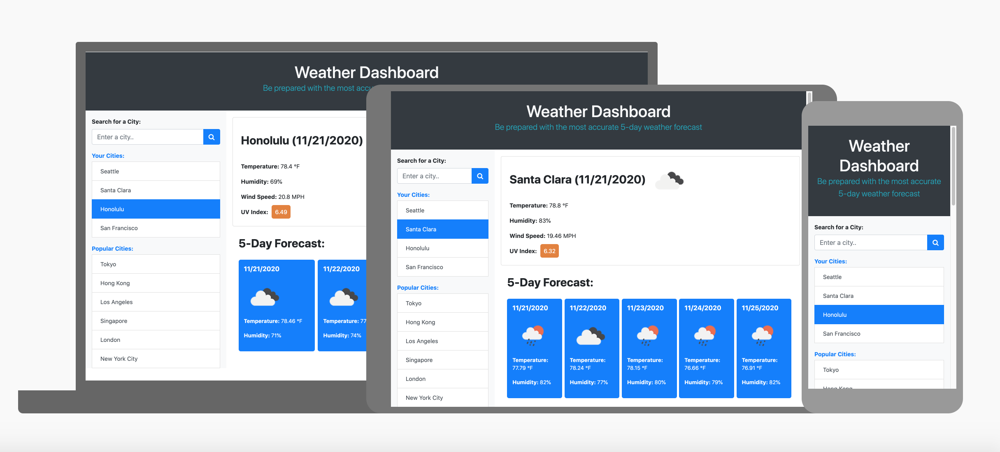
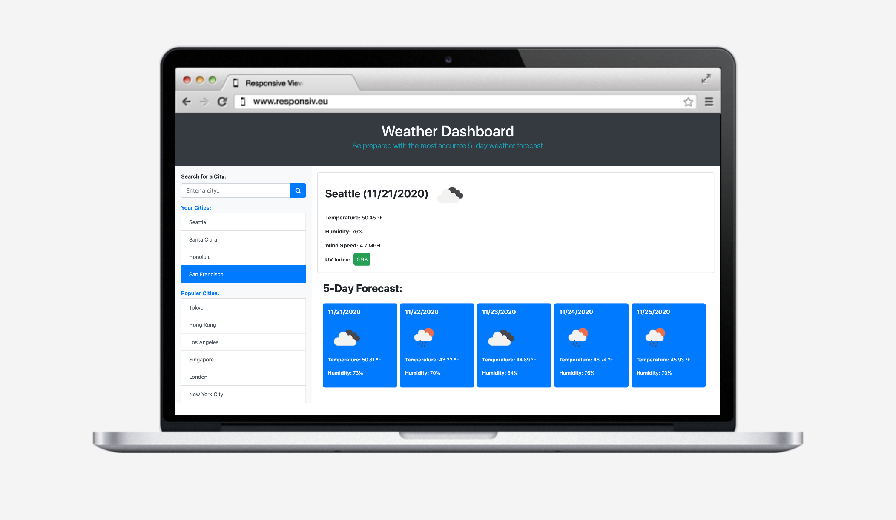

************* OpenWeather API built by OpenWeather **************
this project was based on the api built by openweather.

# Weather Dashboard Using The OpenWeather API

## Description

An API (application programming interface) allows one application to communicate to another. More importantly, a third-party API allows you to access a third parties functionality or data to use on your own site or application. I like to think of an API as a waiter in a restaurant; similarily to how a waiter acts as the direct means of communication between a customer and the kitchen, an API acts as a messenger that listens for a user's request, and reponds by telling the system what to do and delivering the response back to the user.

Since it's always important to check the weather forecast for a destination before leaving so that you are well prepared, I created this weather dashboard to help you check the weather outlook for multiple cities so that they can plan a trip accordingly. Weather conditions of particular city are fetched from OpenWeatherMaps by sending requests for location, current temperature, humidity, wind speed, UV index and weather icon to the third-party [**OpenWeather API**](https://openweathermap.org/api). This application runs in the browser and features dynamically updated HTML and CSS.

There are a variety of weather APIs freely available to use, however, I used the [**OpenWeather API**](https://openweathermap.org/api). This third-party API gives us the advantage of not needing to constantly update the weather manually. Instead using JavaScript, we can pull weather data from the API into our weather dashboard application by making requests with specific parameters to a URL. Since developers are often tasked with retrieving data from another application and using it in the context of their own, it can be advantageous to use third-party API's.

### How the weather dashboard works

This weather dashboard uses form inputs.

1. When a user wants to search for a city they will be presented with current and future conditions for that city and that city is added to their search history.
2. When a user views the current weather conditions for that city, they will be presented with the city name, the date, an icon representation of weather conditions, the temperature, the humidity, the wind speed, and the UV index.
3. When a user views the UV index, they are presented with a color that indicates whether the conditions are favorable, moderate, or severe
4. When a user views future weather conditions for that city, they are presented with a 5-day forecast that displays the date, an icon representation of weather conditions, the temperature, and the humidity.
5. When a user clicks on a city in their search history, they are again presented with the current and future weather conditions for that city.

### Mock-Up

The following animation demonstrates the applications functionality:

This weather dashboard is responsive, meaning that the layout and content responds and adapts based on the size of screen in which it is presented on. See image below:
The following animation shows the web application's appearance and functionality:

